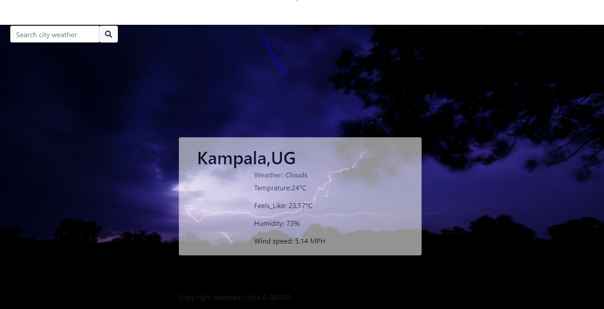

# weatherapp
This is a weather forecast application.  It uses an open weather data website API to get the data. It displays the weather and the background image which represents the weather. It takes the city name as an input. 

## How to use the API
- Open https://openweathermap.org/ website
- Sign up/Sign in  for that website using the link at the top left corner
- Then your user name will appear in the top left corner with a drop-down button, click that you will see a My API Keys menu, then you can get the key from the keys section which opens the app when the menu is clicked.
- To see how to use it:- under the Current Weather Data section click the API doc button
For example
Use this api with your api key https://api.openweathermap.org/data/2.5/weather?q=${city}&appid=[API-KEY]&units=metric

## Built With

- HTML5
- CSS3
- BOOTSTRAP4
- Javascript
- Webpack

## Live Demo

[Live Demo](https://lidya1234.github.io/weather_app/.)

## Getting Started

To get a local copy of it and run it, follow these simple example steps.

- git clone [Repo](https://github.com/Lidya1234/weather_app)

### Prerequisites

- code editor
- Browser

### Usage

Accessing the application requires a running server. This can easily be achieved from the project's root directory by running first `npm install` to install required dependencies and later `npm start` to start the server. The app will now be accessible at the following URL: `http://localhost:8080/`.

### Setup

- install code editor
- Browser

## Author Details

👤 **Lidya Ghebreigziabher**

- Github: [@Lidya-github](https://github.com/Lidya1234)

- Twitter: [@Lidya-twitter](https://twitter.com/Lidya42676629)

- Linkedin: [Lidya-linkedin-link](https://www.linkedin.com/in/lidya-ghebreigziabher-4a94391aa/)

## 🤝 Contributing

Contributions, issues and feature requests are welcome!

## Show your support

Give a ⭐️ if you like this project!
